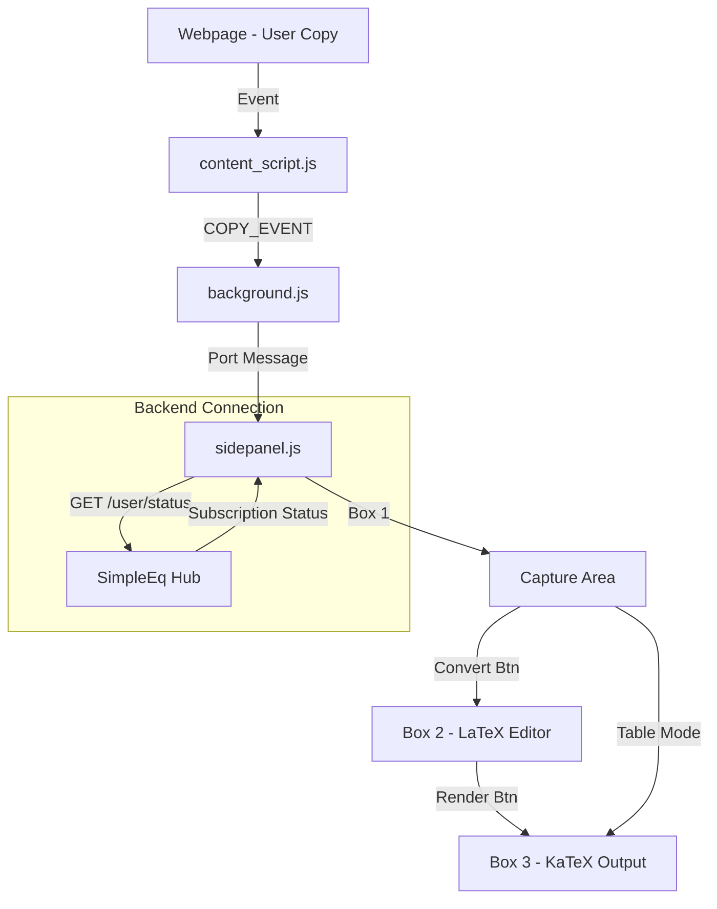

# 🗺️ Project Map: Simple Eq

## 🧭 Philosophy
"Seamless Math Conversion for Educators"
Simple Eq มีเป้าหมายเพื่อเป็นสะพานเชื่อมระหว่างเนื้อหาคณิตศาสตร์ที่ "คัดลอกมา" กับ "ผลลัพธ์ที่สวยงาม" โดยลดขั้นตอนการพิมพ์ LaTeX เองให้เหลือน้อยที่สุด และรักษาโครงสร้างเดิมของเอกสาร (โดยเฉพาะตาราง) ไว้ให้ได้มากที่สุด

## 📍 Key Landmarks
-   `manifest.json`: แผนผังระบบ (Permissions: sidePanel, clipboardRead)
-   `content_script.js`: "The Ear" ดักฟังเหตุการณ์ Copy จากหน้าเว็บ
-   `background.js`: "The Bridge" ส่งต่อข้อมูลจาก Ear ไปยัง Side Panel
-   `sidepanel/`: "The Control Room" UI และ Logic ทั้งหมด
    -   `index.html`: โครงสร้าง 3 กล่อง (Capture -> Editor -> Output)
    -   `sidepanel.js`: หัวใจของระบบ (Conversion & KaTeX Rendering)
-   `vendor/katex/`: "The Engine" หัวใจการเรนเดอร์สมการ (Local Copy)

## 🔄 Data Flow

## 🛠️ Tech Stack
-   **Core**: Vanilla JavaScript (ES6)
-   **Extension**: Chrome MV3
-   **Math**: KaTeX v0.16.x
-   **Styles**: Glassmorphism CSS
-   **Connectivity**: Fetch API to [simple-eq-hub](projects/simple-eq-hub)

## 🔗 Backend Hub (The Brain)
- **Central Hub**: [projects/simple-eq-hub](projects/simple-eq-hub)
- **Purpose**: Identity management, Admin approval, and Subscription validation.
- **Protocol**: 
    1. Extension opens Hub's login page in a new window.
    2. Shared session/cookie used for API calls.
    3. Extension restricts "Pro" rendering based on Hub response.

## 🎨 UI/UX & Theme (Design System)
-   **Theme**: **Dark Glassmorphism** (Modern & Professional)
-   **Colors**:
    -   `Background`: Deep Blue (`#0f172a`) with Linear Gradient (`#1e3a5f`).
    -   `Surface`: White Transparent (`rgba(255,255,255,0.05)`).
    -   `Primary`: Blue (`#3b82f6`) & Purple (`#a855f7`) Gradient for Render button.
    -   `Secondary`: Green (`#10b981`) for Success states.
    -   `Text`: Slate White (`#e2e8f0`).
-   **Typography**: **Inter** sans-serif (Google Fonts).
-   **Key Visuals**:
    -   `Rounded Corners`: Buttons/Boxes use `12px` to `16px` radius.
    -   `Borders`: Subtle white transparency (`rgba(255,255,255,0.10)`).
    -   `Badges`: Step indicators (1, 2, 3) in Blue, Purple, and Green circles.
    -   `Animation`: Pulse effect on the "⚡ Auto" badge.
-   **UX Flow**: 3-Box System (Capture -> LaTeX Editor -> Rendered Output) with clear visual progression.

## 🐉 Challenges & Debt
-   **HTML Cleaning**: การจัดการ Inline styles จาก MS Word ยังทำแบบหยาบๆ (Remove all style/class) อาจทำให้ Formatting บางอย่างหายไป
-   **Regex Limitations**: ตัวแปลง `convertSymbols` ยังรองรับแค่รูปแบบพื้นฐาน ถ้าเจอสมการซับซ้อนมากต้องแก้ไขด้วยมือใน Box 2
-   **No Persistence**: สถานะใน Side Panel จะหายไปหากปิด Panel หรือ Refresh Extension (ไม่มี LocalStorage sync สำหรับร่างที่ทำค้างไว้)

---
*Last Updated: 2026-02-24 via Oracle Keeper*
